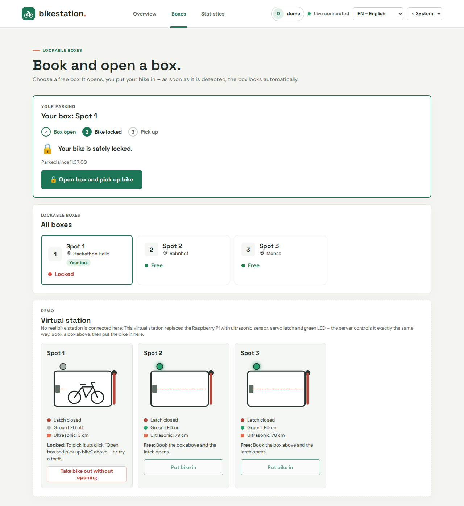
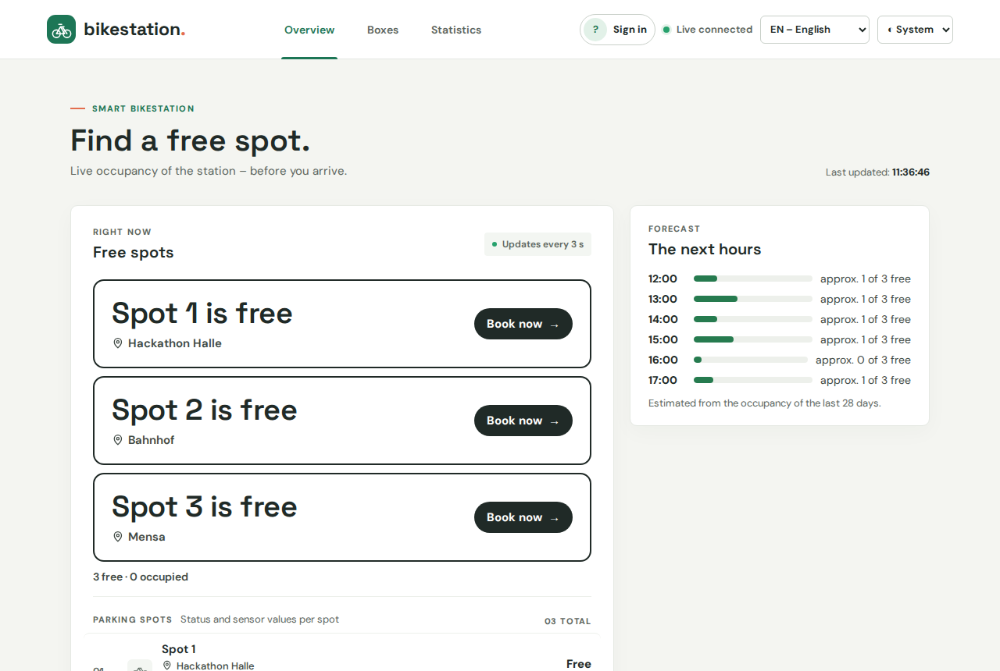
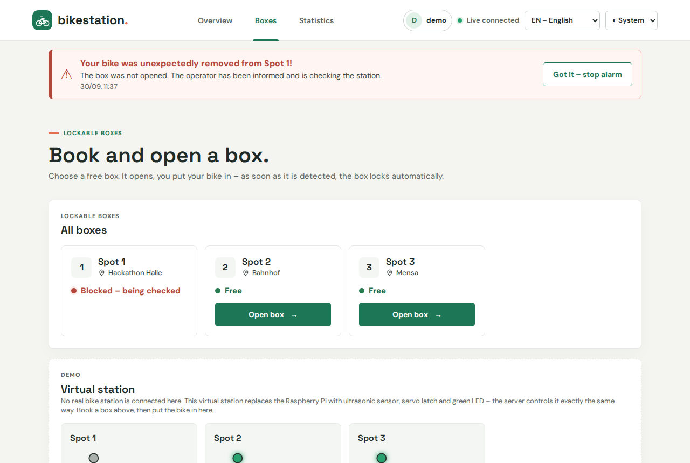
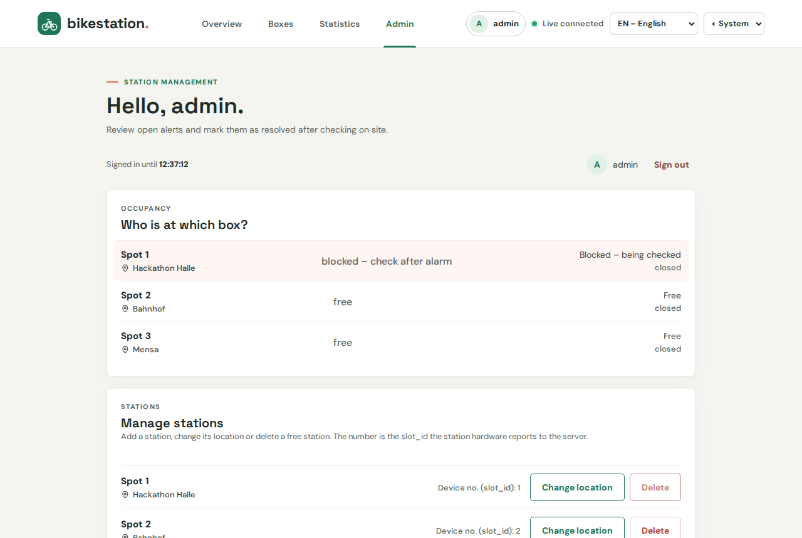

# Smart Bikestation

> 🥉 **3rd place at the Euregio Hackathon Mobility 2026** (September 28–29, 2026)
>
> This project was built during the hackathon. The repository shows the state at the end of the event,
> cleaned up and with a demo mode so you can try it without the physical station.

A lockable bike parking station with a web app. You see which boxes are free, book one with a click, a servo
latch opens, an ultrasonic sensor detects your bike and the box locks itself. To pick the bike up you open the
box again from the app. If a bike disappears from a locked box without being opened, the owner gets an alarm on
the phone, the red LED at the box starts blinking and the box stays blocked until an admin has checked it.

**Features**

- **Live overview** of free boxes with their location and a forecast for the next hours
- **Book and open** a box with one click – the latch opens, the bike is detected, the box locks automatically
- **Theft alarm** when a bike leaves a locked box: banner and sound in the app, blinking red LED at the station
- **Admin area**: who is at which box, alerts, release blocked boxes, add or remove stations, full box log
- **Statistics** (occupancy by hour and day) and a statistical anomaly detection in the backend
- Web app in **German, English and Dutch**, light and dark mode, usable with keyboard and screen reader



---

## Try the demo

No hardware needed – a **virtual station** replaces the Raspberry Pi. The server controls it exactly like the
real one: it reports the ultrasonic distance every second, and the server's answer moves the latch and switches
the green LED. You put the bike in or take it out with a button.

**With Docker** (nothing else to install):

```bash
git clone https://github.com/LaurenzBonke/Bikestation.git
cd Bikestation
docker compose up --build
```

Then open **http://localhost:8080**.

**Without Docker** (needs [.NET 10 SDK](https://dotnet.microsoft.com/download) and [Node.js](https://nodejs.org) 20.19+):

```bash
python demo.py          # builds the dashboard, starts the server and opens the browser
python demo.py --reset  # start again with a fresh demo database
```

The demo creates two accounts (the sign-in page has one-click buttons for both) and 14 days of sample data, so
statistics and forecast have something to show:

| User | Password | Role |
|---|---|---|
| `demo` | `bikestation-demo` | user |
| `admin` | `bikestation-admin` | admin |

### A short tour

1. **Account** → *Sign in as demo*. You land on **Boxes**.
2. *Open box* on Spot 1 – in the virtual station below, the latch swings open.
3. *Put bike in* – the sensor reads 3 cm, after 5 seconds the box locks and the green LED goes off.
4. *Open box and pick up bike* → *Take bike out* – after 5 seconds the box is free again.
5. Try a theft: park again, then *Take bike out without opening*. The alarm banner appears (with sound),
   the box is blocked.
6. Sign in as **admin** → **Admin**: who is at which box, alerts, release the blocked box, box log,
   add or delete stations.
7. **Statistics**: occupancy by hour and day, forecast for the next hours.

| Overview | Theft alarm | Admin |
|---|---|---|
|  |  |  |

---

## What we built at the hackathon

**Station:** one box model with a **Raspberry Pi 5**. Sensor, servo and LEDs sit on a breadboard and are wired
directly to the Pi's GPIO pins – no microcontroller in between.

| Part | GPIO | Role |
|---|---|---|
| HC-SR04 ultrasonic sensor | Trigger GPIO4, Echo GPIO14 (voltage divider) | detects the bike (≤ 7 cm) |
| Servo | GPIO15 | latch: 90° open, 45° closed |
| Green LED + 330 Ω | GPIO17 | on while no bike is locked in |
| Red LED + 330 Ω | GPIO27 (pin 13) | on while a bike is locked in, **blinks** when a bike was removed without authorization |

Every second the Pi measures the distance, sends it to the server and sets latch and LEDs the way the server's
answer says – all decisions are made by the server. Station program: [`pi/`](pi/README.md).

**Server:** ASP.NET Core API + React dashboard in one process on port 8080, running on a Windows PC in the
hall's network. Phones and the Pi connected over the LAN. Details: [deploy/README.md](deploy/README.md).

**Pitch:** [one-page pitch (PDF)](docs/pitch/Smart-Bikestation-Pitch.pdf) ·
[user journey deck (PowerPoint)](docs/journey/Smart-Bikestation-User-Journey.pptx)

---

## How it works

```
 Station                                   Server                                      Browser
 ──────────────────────────                ───────────────────────────────────         ─────────────────
 Raspberry Pi 5 + breadboard               ASP.NET Core 10 API (C#)       :8080         React dashboard
 HC-SR04 · servo latch · 2 LEDs    ──►     ├─ BoxService (state machine)        ◄──    (served by the API)
 pi/parking_sensor.py         HTTP + key   ├─ SQLite database                   JWT
                                           ├─ background workers: timeouts,
   ◄── answer: {boxState, lockOpen} ──     │  anomaly detection, data retention
                                           └─ demo mode: virtual station instead of the Pi
```

The station sends `POST /api/sensor-data {slotId, distance, pressure, vibration}` every second (header
`X-Api-Key`) and gets `{boxState, lockOpen}` back. That is the whole device protocol – every decision is made
by the server.

### Box state machine (`api/bikestation/bikestation/Services/BoxService.cs`)

```
Free ──user books──► OpenForParking ──bike ≤ 7 cm for 5 s──► Locked ──owner "pick up"──► OpenForPickup
  ▲                      │ cancel / 120 s no bike                │                            │ bike gone 5 s
  └──────────────────────┘                                       │                            ▼
  ▲                                                              │ bike gone WITHOUT opening  Free
  └──────── admin releases ◄── Blocked (ALARM) ◄─────────────────┘ (3 s)
OpenForPickup ──120 s, bike still there──► Locked
```

The latch is open only in `OpenForParking` and `OpenForPickup`. At the station the green LED is on unless a bike
is locked in; the red LED is on in `Locked` and blinks in `Blocked`. Every transition is written to the box log.
Also included: statistics, occupancy forecast from the last 28 days, and a statistical anomaly detection
(robust z-score) that runs inside the backend.

More diagrams (system, states, data model, sequences, security): [docs/ARCHITEKTUR.md](docs/ARCHITEKTUR.md) (German).

---

## Repository layout

| Path | What | Tech |
|---|---|---|
| `api/bikestation/bikestation` | Backend: API, state machine, database, demo mode | C# / ASP.NET Core 10 / EF Core SQLite |
| `api/bikestation/bikestation.Tests` | 67 integration and unit tests | xUnit, WebApplicationFactory |
| `Frontend/api` | Dashboard for users and admins | React 19, TypeScript, Vite |
| `pi` | Station program for the Raspberry Pi | Python 3, gpiozero + lgpio |
| `deploy` | Scripts to publish, start and update the server on Windows | PowerShell |
| `docs` | Architecture, pitch, user journey, screenshots | – |
| `Dockerfile`, `docker-compose.yml`, `demo.py` | Demo without hardware | – |

The sub-folders have their own READMEs (in German).

## Development

```bash
# Backend → http://localhost:5137 (API docs at /scalar)
cd api/bikestation/bikestation
dotnet run                           # or: dotnet run --launch-profile demo  (virtual station, demo accounts)

# Dashboard → http://localhost:5173 (proxies /api to :5137)
cd Frontend/api
npm install
npm run dev
```

Tests:

```bash
cd api/bikestation && dotnet test                # 67 tests
cd Frontend/api && npx tsc -b && npm run build
```

Development and demo keys live in `appsettings.Development.json` / `appsettings.Demo.json`. In production the API
refuses to start without real keys (`Jwt__Key` ≥ 32 characters, `Devices__ApiKey` ≥ 16 characters as environment
variables); `deploy/publish.ps1` generates them.

## Status and next steps

This is a hackathon prototype. What we would do next:

- **HTTPS** (reverse proxy with a certificate) – also needed for push notifications when the phone is locked
- More stations (school, train station, canteen) – each station reports its own number, the server does the rest
- A pressure sensor as second detection (the Pi needs an ADC such as the ADS1115)
- Keep the latch closed when the Pi loses the connection to the server (today it falls back to simple local logic)
- Run the server on Linux instead of the Windows PC, EF Core migrations for a real database server
