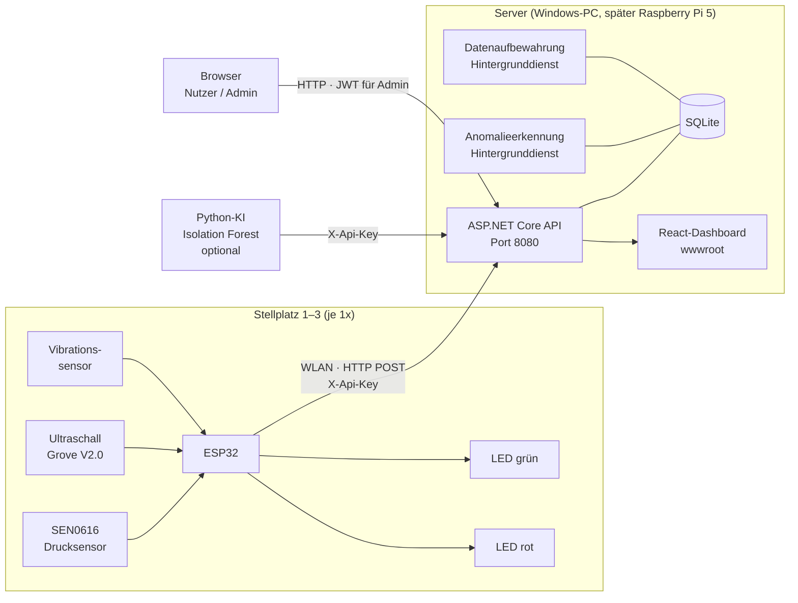
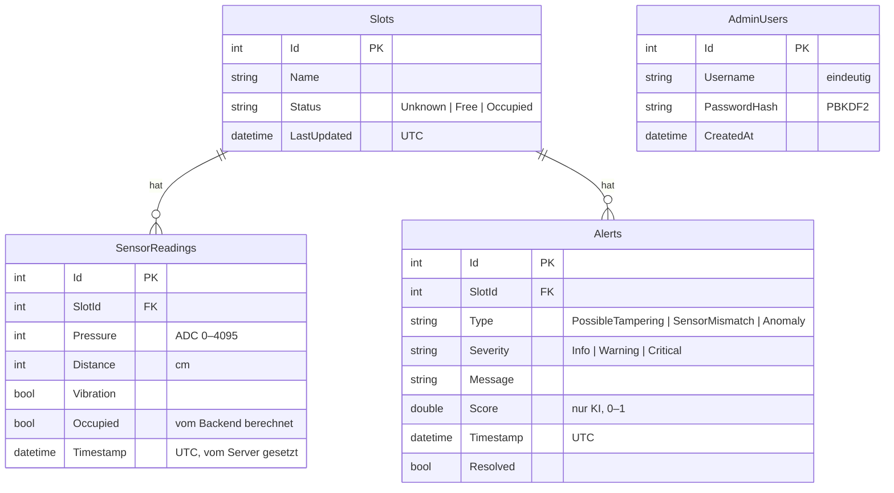
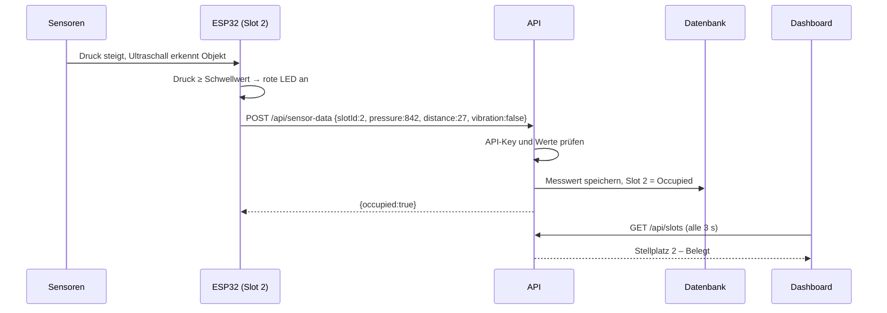
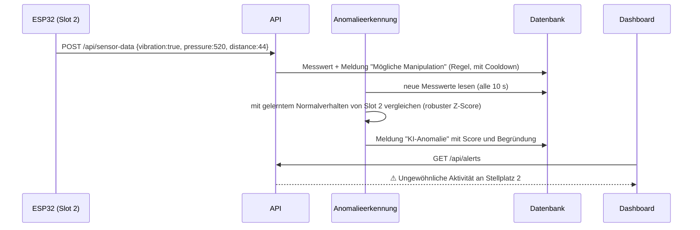

# Smart Bikestation – Architektur

Die Diagramme sind in Mermaid geschrieben und werden auf GitHub direkt als Grafik angezeigt.

## Systemübersicht



## Datenmodell (ER-Diagramm)



Keine personenbezogenen Daten: gespeichert werden nur Stellplatz, Sensorwerte, Zeit und technische
Ereignisse. Messwerte werden nach 90 Tagen automatisch gelöscht (`Retention:ReadingDays`).

## Ablauf: Fahrrad wird abgestellt



## Ablauf: Manipulation



## Anomalieerkennung

Zwei Stufen, damit es nicht nur ein „wenn Vibration, dann Alarm“ ist:

| Stufe | Wo | Wie |
|---|---|---|
| Regel | `SensorDataService` | Vibration → Meldung „Mögliche Manipulation“ (max. 1 pro Minute und Platz) |
| Statistisch lernend | `AnomalyDetector` + `AnomalyDetectionWorker` im Backend | Lernt pro Platz und Zustand (frei/belegt) Median und Streuung (MAD) von Druck, Abstand und deren Änderungen. Robuster Z-Score ≥ 6 → Anomalie. Vibration allein reicht nicht, verstärkt aber echte Abweichungen. |
| Maschinelles Lernen (optional) | `ai/anomaly_service.py` | Isolation Forest (scikit-learn) auf denselben Merkmalen, meldet über `POST /api/anomalies` |

Erkannt werden z. B. Rütteln mit Druckabfall bei stehendem Rad oder widersprüchliche Sensoren
(Druck „belegt“, Ultraschall „leer“). Normales Kommen und Gehen löst nichts aus.

## Auslastungsprognose

`GET /api/forecast` schätzt die freien Plätze der nächsten Stunden aus der Belegung der letzten
28 Tage am selben Wochentag zur selben Stunde. Gibt es dafür zu wenig Daten, wird die gleiche Stunde
über alle Tage genutzt.

## Sicherheit

| Maßnahme | Umsetzung |
|---|---|
| Geräte-Authentifizierung | API-Key im Header `X-Api-Key`, Vergleich in konstanter Zeit |
| Admin-Authentifizierung | JWT (HMAC-SHA256, 60 min), Rolle `Admin` wird geprüft |
| Passwörter | nur PBKDF2-Hash, Admin-Anlage nur per Kommandozeile |
| Brute Force | Rate Limiting: 5 Login-Versuche pro Minute und IP |
| Eingabevalidierung | Wertebereiche für alle Sensorwerte, sonst 400 |
| Fehlerbehandlung | einheitliche ProblemDetails, keine Stacktraces nach außen |
| HTTP-Header | `X-Content-Type-Options`, `X-Frame-Options`, `Referrer-Policy` |
| Geheimnisse | nicht im Repo, zufällig erzeugt, per Umgebungsvariable |
| Datenschutz | keine Kameras, keine Personendaten, Löschung nach 90 Tagen |

## Tests

`api/bikestation/bikestation.Tests`: Integrationstests starten die echte API mit eigener SQLite-Datei
(API-Key, Validierung, Belegung, Meldungen, JWT, Rate Limit, KI-Anomalien, Statistik, Prognose,
Datenaufbewahrung, veraltete Datenbank) und Unit-Tests für den `AnomalyDetector`.

```powershell
cd api/bikestation
dotnet test
```
