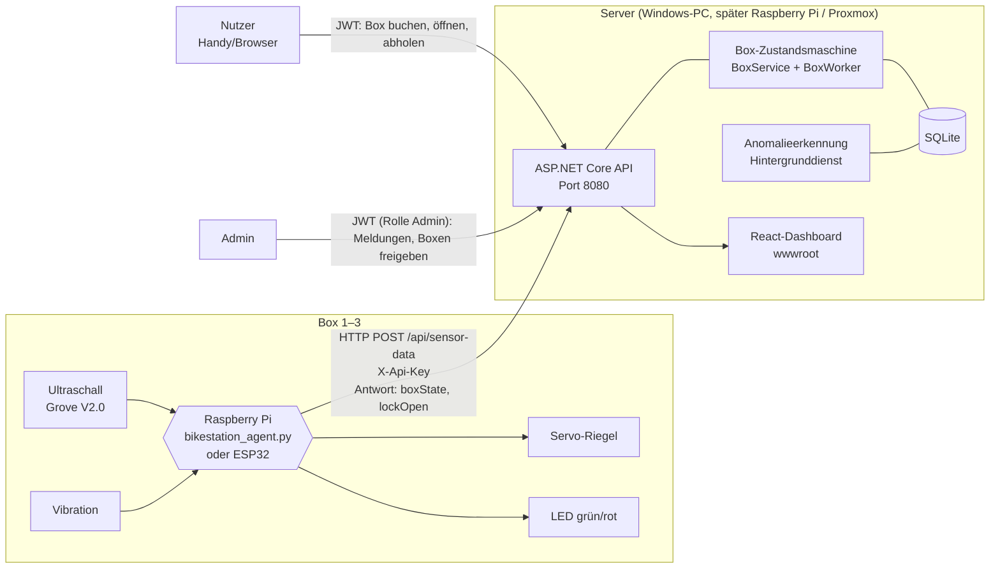
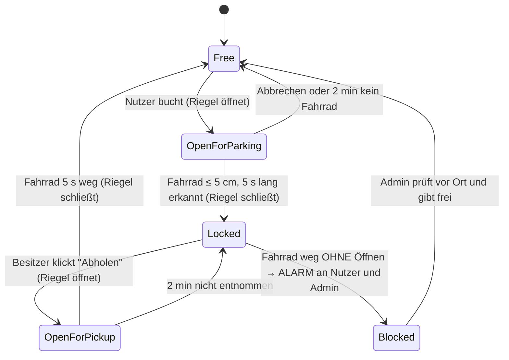
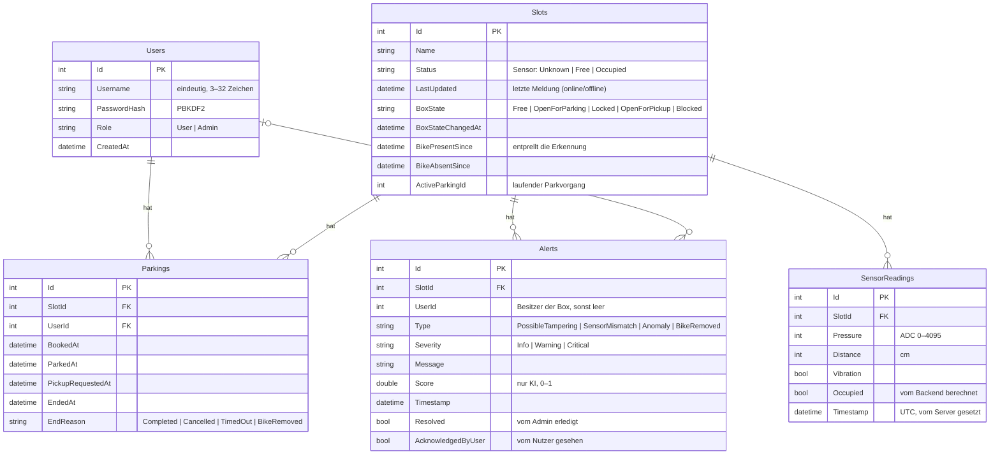
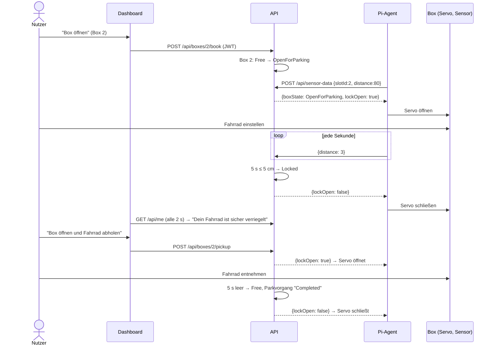
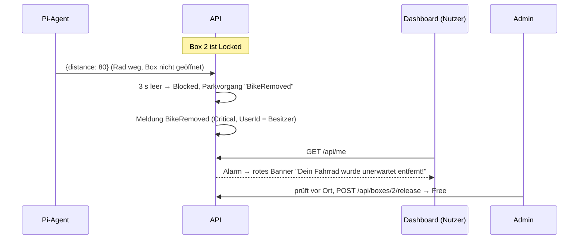

# Smart Bikestation – Architektur

Die Diagramme sind in Mermaid geschrieben und werden auf GitHub direkt als Grafik angezeigt.

## Idee

Die Station hat abschließbare **Boxen** (Prototyp: 3). Nutzer legen ein Konto an, wählen im Web-Dashboard eine
freie Box und öffnen sie per Klick. Ein Servo-Riegel öffnet, das Fahrrad wird eingestellt, der Ultraschallsensor
erkennt es, und die Box verriegelt automatisch. Zum Abholen öffnet der Nutzer die Box wieder per Klick. Wird ein
Fahrrad entfernt, **ohne** dass die Box geöffnet wurde, bekommt der Nutzer sofort einen Alarm in der App.

Das erfüllt die Grundaufgabe: freie Plätze erkennen und anzeigen, Manipulation erkennen (Vibration,
KI-Anomalieerkennung, unerwartete Entnahme), Daten speichern und auswerten (Statistik, Prognose), keine
personenbezogenen Daten (Konto = nur Benutzername und Passwort-Hash), barrierearm, in 3 Sprachen.

## Systemübersicht



## Zustände einer Box



Abstände und Zeiten stehen in `appsettings.json` unter `Box` (kalibrierbar). Wartezeiten zählen erst ab dem
Zustandswechsel, damit einzelne Messausreißer den Riegel nicht schalten. Buchen und Abholen sind nur möglich,
wenn die Station verbunden ist.

## Datenmodell (ER-Diagramm)



Datenschutz: Konten enthalten nur Benutzername und Passwort-Hash. Gespeichert werden sonst nur Box, Sensorwerte,
Zeit und technische Ereignisse. Messwerte werden nach 90 Tagen automatisch gelöscht (`Retention:ReadingDays`).

Datenbank-Updates: Passt die Datei nicht mehr zum Modell, sichert der `DatabaseInitializer` sie und übernimmt alle
Daten spaltenweise in das neue Schema – auch im Produktionsbetrieb, ohne Datenverlust.

## Ablauf: Box buchen, parken, abholen



## Ablauf: Fahrrad unerwartet entfernt



## Anomalieerkennung

Mehrere Stufen, damit es nicht nur ein „wenn Vibration, dann Alarm“ ist:

| Stufe | Wo | Wie |
|---|---|---|
| Regel | `SensorDataService` | Vibration → Meldung „Mögliche Manipulation“ (max. 1 pro Minute und Box), geht auch an den Besitzer |
| Zustand | `BoxService` | Fahrrad verschwindet aus verriegelter Box → Alarm „unerwartet entfernt“ |
| Statistisch lernend | `AnomalyDetector` + `AnomalyDetectionWorker` | Lernt pro Box und Zustand Median und Streuung (MAD) von Druck, Abstand und deren Änderungen. Robuster Z-Score ≥ 6 → KI-Anomalie. Vibration allein reicht nicht. |
| Maschinelles Lernen (optional) | `ai/anomaly_service.py` | Isolation Forest (scikit-learn), meldet über `POST /api/anomalies` |

## Auslastungsprognose

`GET /api/forecast` schätzt die freien Plätze der nächsten Stunden aus der Belegung der letzten
28 Tage am selben Wochentag zur selben Stunde. Gibt es dafür zu wenig Daten, wird die gleiche Stunde
über alle Tage genutzt.

## Sicherheit

| Maßnahme | Umsetzung |
|---|---|
| Geräte-Authentifizierung | API-Key im Header `X-Api-Key`, Vergleich in konstanter Zeit |
| Nutzer-Authentifizierung | JWT (HMAC-SHA256, 60 min), Rollen `User` / `Admin` |
| Rechte | Nur der Besitzer öffnet seine Box; Admin-Funktionen nur mit Rolle `Admin`; max. 1 Box pro Nutzer |
| Passwörter | nur PBKDF2-Hash, mind. 8 Zeichen; Admins nur per Kommandozeile |
| Brute Force / Spam | Rate Limiting: 5 Logins pro Minute, 5 Registrierungen pro 10 Minuten und IP |
| Eingabevalidierung | Wertebereiche für Sensorwerte, Benutzername nur `A–Z a–z 0–9 _ . -` |
| Physische Sicherheit | Riegel folgt nur der API; ohne Verbindung bleibt er, wie er ist; unerwartete Entnahme → Alarm + Sperre |
| Fehlerbehandlung | einheitliche ProblemDetails, keine Stacktraces nach außen |
| HTTP-Header | `X-Content-Type-Options`, `X-Frame-Options`, `Referrer-Policy` |
| Geheimnisse | nicht im Repo, zufällig erzeugt, per Umgebungsvariable |
| Datenschutz | keine Kameras, keine Personendaten, Löschung nach 90 Tagen |

## Tests

| Bereich | Wo | Umfang |
|---|---|---|
| Backend | `api/bikestation/bikestation.Tests` | 56 Tests: Konten, Boxen-Ablauf, Alarm, Rechte, Zeitlimits, Offline, API-Key, Validierung, KI, Statistik, Prognose, Migration |
| Pi-Agent | `pi/test_agent.py` | 7 Tests inkl. Ende-zu-Ende gegen das echte Backend (simulierter Servo) |
| Server-Update | `deploy/update-server.ps1` | an separatem Test-Server geprüft (Update mit Datenerhalt, Abbruch bei kaputter Version) |

```powershell
cd api/bikestation; dotnet test
cd pi; python -m unittest test_agent.py -v
```
